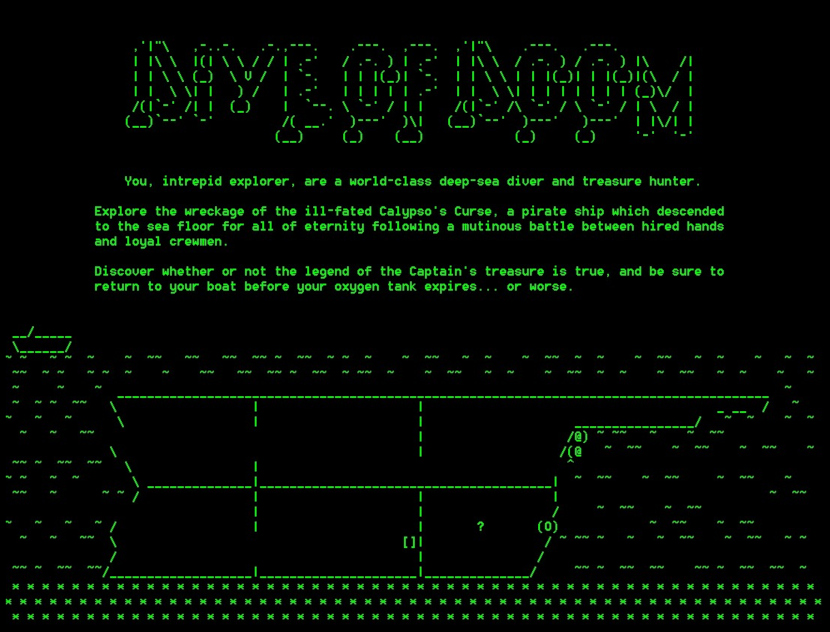
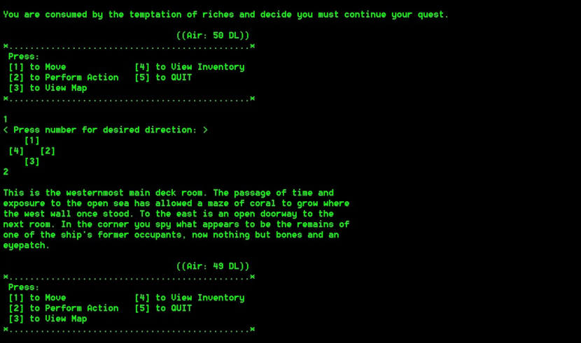

# Dive of Doom
A CLI text-based adventure game in C++

*Please note: As school coursework, this project's content and coding style conform to assignment/instructor specifications.*

### Compilation
From command line: `make`\
Alternatively, if using a preferred IDE:
  - utilize std C++11 
  - .txt files may need to be relocated IDE's expected location for input files (e.g., debug folder)

### Game Play
From command line: `adventure`\
Object: Retrieve the treasure and return to your boat without being killed or exhausting your oxygen tank.\
Follow prompts to move, perform action, select actions, view map, view inventory, etc.\
Press `5` to quit at any time.
